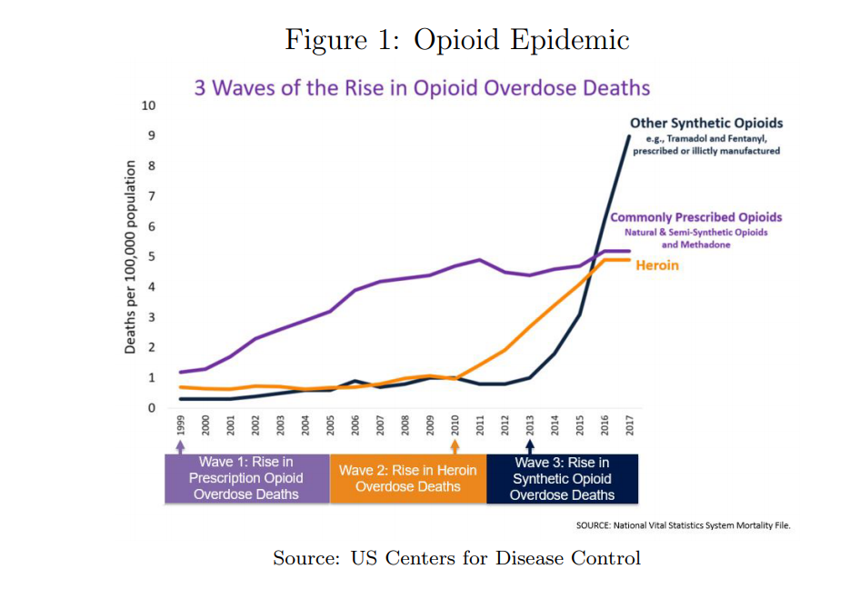

# Estimate of Opioid Impact

Over the past two decades, the United States has seen a tremendous increase in the use and
abuse of prescription opioids, leading not only to a huge rise in opioid addiction, but also a
rise in prescription overdose deaths, and increasingly deaths from non-prescription opioids
like heroin and fentanyl as people who became addicted to opioids due to prescriptions
turn to illegal markets to sustain their addiction.

In this project, we’ll be estimating the effectiveness of policy interventions designed
to limit the over-prescription of opioids. More specifically, we will attempt to measure the
effect of a series of policy changes designed to limited opioid abuse in several US states
on (a) opioid drug prescriptions, and (b) mortality from drug overdoses.

For the full detailed report please view the project summary
